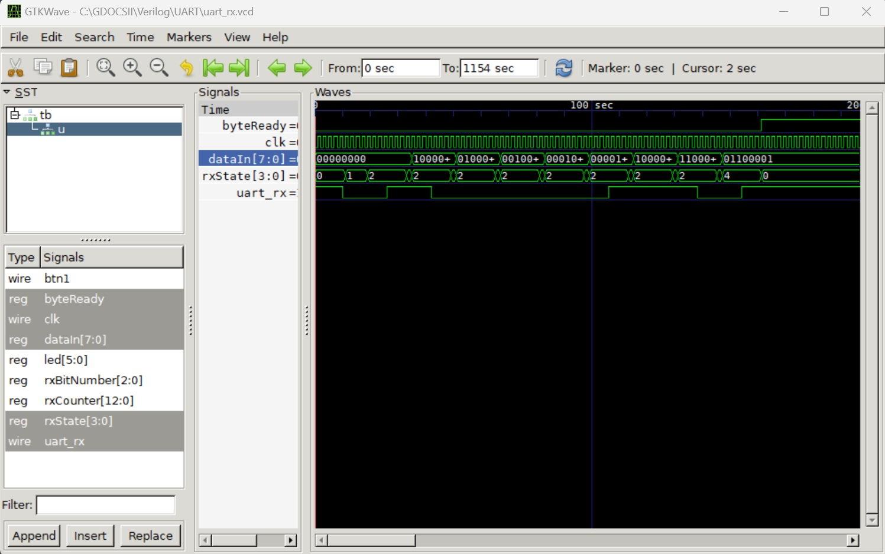

# Tang Nano 9k UART Rx, Tx Simulation and Programming

We adapt the article [Tang Nano 9K: Debugging & UART](https://learn.lushaylabs.com/tang-nano-9k-debugging/) to work with Icaros Verilog for simulation on the Rx side and with Gowin IDE to program the Tang nano 9k board on the Tx side. To program both sides on the Tang nano is not implemented yet.

## Icaros Verilog Simulation of the Rx side

The steps are as follows:

1. Create the files uart_rx.v and uart_rx_tb.v in VS code.
2. In `TERMINAL` type the command

```Verilog
iverilog -o uart_rx.o uart_rx_tb.v
vvp uart_rx.o
gtkwave
```

   3. In the GTKWave windo that pops up select `File` -> `Open New Tab` -> `uart_rx.vcd`. Expand `tb` tab in the SST panel to see a list of the signal waves that you want displayed and then click `Insert`. An example is shown below.


